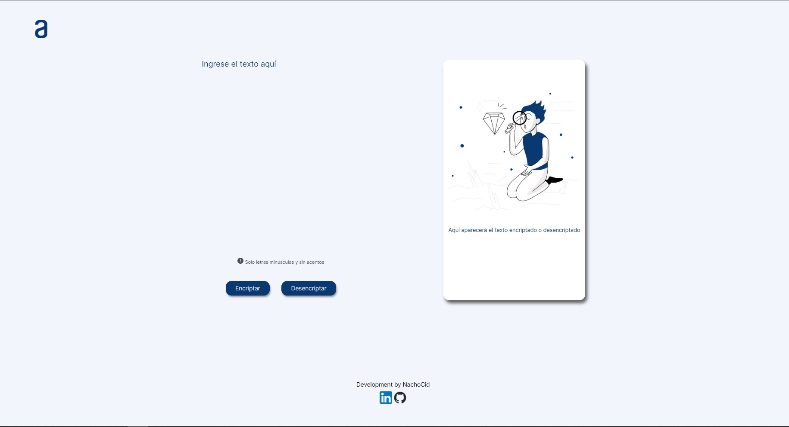

## Encriptador Challenge Alura

Encriptador online como materia de estudio del curso de OracleNext-Alura. En este proytecto podemos realizar el encriptado y desencriptado de un texto según las directrices indicadas en los requerimientos.
Se trabaja con ***Figma*** para el diseno de la web, de acuerdo a lo que diseñador maqueteó como UI. También se trabaja con ***Trello*** para la asignación, avance y terminos de tareas mediante tarjetas.

Proyecto consta de 2 procesos principales a desarrollar los cuales fueron divididos de la siguiente manera: 

1. _Se desarrolla web como primera instancia, solo con vista para ordenador:_
 * Se estructura la forma en que se desarrollará la web y cómo esta se verá.
 * Al terminar casi por completo la estructura que podría ser la definitva, exceptuando algunos pequeños detalles se maqueta el diseño.
 * Se esctructuran las secciones, colores, tipos de fuentes, elementos que aparecerán/desaparecerán dependiendo de alguna acción.
   
2. _Se desarrolla lógica:_
 * Función del botón encriptar
 * Función del botón desencriptar
 * Creación de botón copiar texto final al portapapeles

### Visita la web

Si deseas visitar la web diseñada puedes ingresar en el siguiente [enlace][GitHub Pages]

[GitHub Pages]: https://nachocid.github.io/encriptador-alura/

### He aquí una imagen de la web en su versión v2.0

